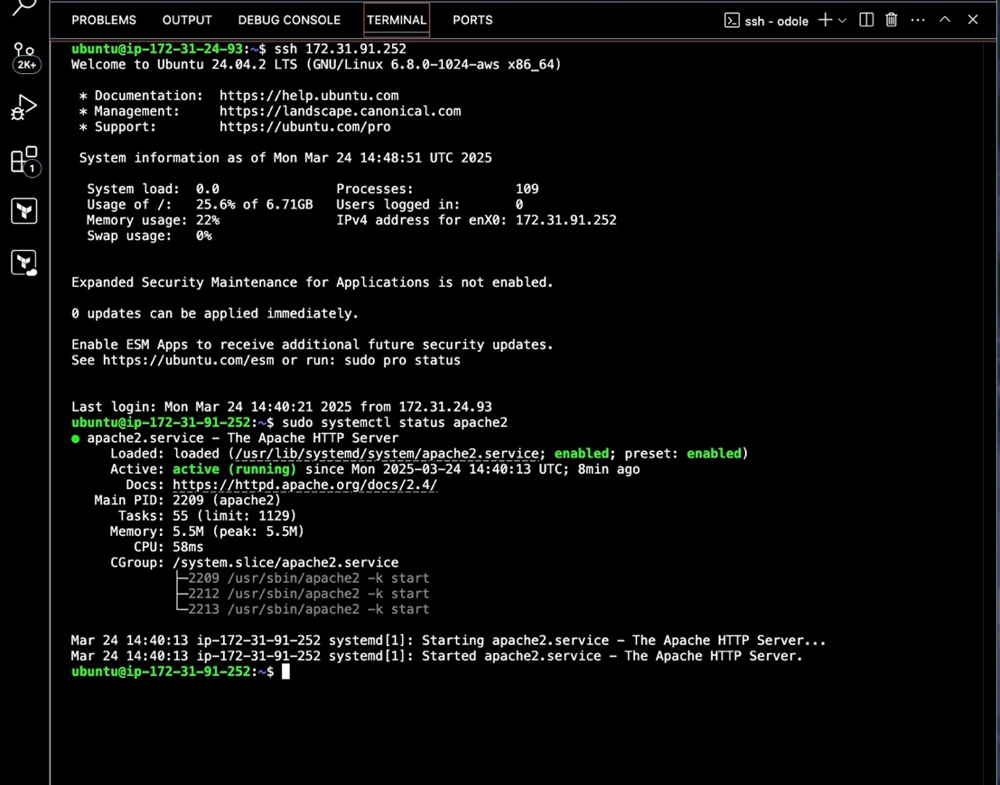
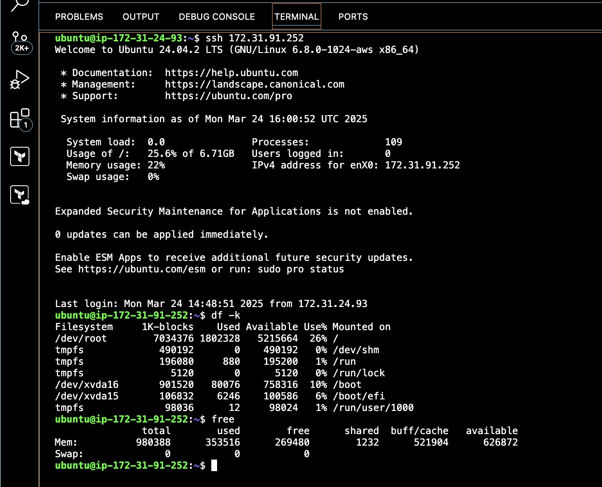

**<u>PROJECT ONE</u>**

**<u>CONFIGURE ANSIBLE ON MASTER SERVER TO INSTALL NGINX ON A TARGET WEB
SERVER (SERVER1) AND APACHE ON DATABASE SERVER (SERVER2)</u>**

**Organization Context:**

1.  **Company Name:** EliteCorperations

2.  **Scenario:** EliteCorperations is a mid-sized tech company that
    needs to automate the deployment and management of its web servers
    and database servers, You were consulted by EliteCoperations to
    manage their web and database server configurations and
    installations

**Project Tasks:**

1.  **Install Nginx Server on Eilte’s corperations Web servers:**

- Use Ansible to automate the setup of web servers with Apache/Nginx.

- On the web servers install APACHE server

- On both servers get their total free disk space (hint: use-\> df)

- On both servers get their available disk space (hint use -\> free)

- Ensure the playbooks install necessary packages,

2.  **Install Apache server on Elite’s Corporations Database server**

- On the Database servers install Nginx servers

- Install the Nginx server by writing a playbook

- On both servers get their total free disk space (hint: use-\> df)

- On both server get their available disk space (hint use -\> free)

**Deliverables:**

- Ansible playbooks and roles for the above tasks.

- Documentation explaining the setup and usage of the playbooks.

- Documentation on the differences between ansible playbook and
  adhoc-commands

**Links to Ansible Documentation:**

- <https://docs.ansible.com/ansible/latest/getting_started/get_started_playbook.html>

- <https://docs.ansible.com/ansible/latest/playbook_guide/playbooks_intro.html#playbook-execution>

This exercise is to help create a practical project that animate
real-world DevOps problems. If you have questions, feel free to ask,
answers will be provided in the slack channel.

**<u>SOLUTION</u>**

**ANSIBLE MACHINE (AnsibleTest):**

**Instance:**
i-0be0e053fa8b4c1b3

**Public IP Address:** 34.229.16.103

**Private IP Address:** 172.31.24.93

**Connect:** ssh -i "Downloads/AnsibleKey.pem"
ubuntu@ec2-34-229-16-103.compute-1.amazonaws.com

**Public Key:** id_ed25519.pub (/home/ubuntu/.ssh)

**SERVER1 (WEB SERVER):**

**Instance:** i-0bc4f98c05e820b9a

**Public IP Address:** 3.86.45.122

**Private IP Address:** 172.31.94.227

**Connect:** ssh -i "Downloads/server1.pem"
ubuntu@ec2-3-86-45-122.compute-1.amazonaws.com

**SERVER2 (DATABASE SERVER):**

**Instance:** i-0ef7b46d50f8853dd

**Public IP Address:** 34.238.41.148

**Private IP Address:** 172.31.95.234

**Connect:** ssh -i "Downloads/server2.pem"
ubuntu@ec2-34-238-41-148.compute-1.amazonaws.com

Log into the Ansible controlled machine and run the “**sudo apt
update”** command

Install Ansible using the following command “**sudo apt install
ansible**”

Create public and private keys using the command “**ssh-keygen**”

Create a bash file called **setup_ssh.sh** to copy the public key from
ansible controlled server to our target web and database servers.

Now, run the setup_ssh.sh file to copy the public key to the other two
target servers

Create an inventory file

Enter the IP Addresses of the web and application server into the
inventory file as shown below

Create a yml file

Place the following content into the created yml file

Run the following command: **ansible-playbook -i inventory
install_services.yml**

To check if ngix has been truly installed on server1, use the following
command: **sudo systemctl status nginx**

To check if Apache has been truly installed on server2, use the
following command: **sudo systemctl status apache2**

Using the following command, df -k, obtain the available and free disk
space.

